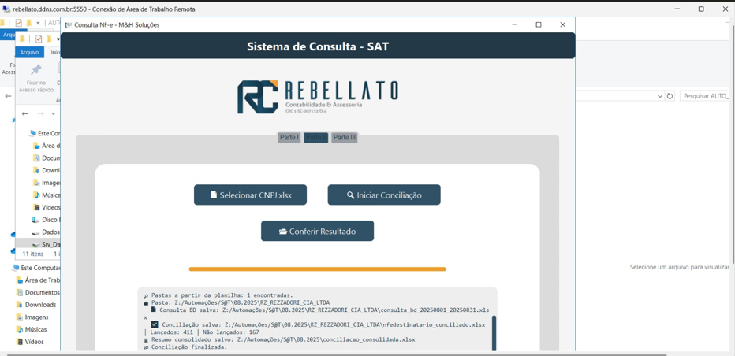

# ⚙️ Rebellato – Automação Fiscal Completa (NF-e / NFC-e / CTe + Conciliação Firebird)

Sistema desktop e CLI desenvolvido em **Python** que automatiza **consultas fiscais** no **SAT/SEF-SC**, emite relatórios de NF-e, NFC-e e CTe, e realiza **conciliação automática com ERP Questor (Firebird)**.

> Projeto desenvolvido e mantido por **Luccas Flores (M&H Soluções)** como parte de uma suíte de automações fiscais e contábeis.

---

## 🚀 Funcionalidades

✅ **Consulta automática no SAT/SEF-SC**
- Baixa NF-e / NFC-e (emitente e destinatário)
- Baixa CTe por tomador  
- Trata captchas via **2Captcha API**

✅ **Conciliação com Firebird (ERP Questor)**
- Consulta dados diretamente do banco Questor
- Cruzamento automático por valor, base e ICMS
- Geração de relatórios Excel prontos para conferência

✅ **Interface moderna (CustomTkinter)**
- Três módulos: **SAT**, **Conciliação** e **CTe**
- Logs em tempo real e barras de progresso
- Paleta visual da empresa Rebellato Contabilidade

✅ **Execução em Modo Automático (CLI)**
- Parâmetros por linha de comando
- Ideal para automações via agendador de tarefas (Windows)

---

## 🧱 Arquitetura do Projeto

```bash
Rebellato/
├── src/
│   ├── app/
│   │   └── ui.py               # Interface gráfica (CustomTkinter)
│   ├── core/
│   │   ├── utils.py            # Funções auxiliares e normalização
│   │   ├── firebird.py         # Conexão e consultas no ERP Questor
│   │   ├── sat_pages.py        # Interações Playwright com o SAT
│   │   ├── sat_client.py       # Lógica de automação e controle
│   │   └── reconciliation.py   # Conciliação de NFes e relatórios
│   ├── cli.py                  # Interface de linha de comando
│   └── tests/                  # Testes unitários e de integração
│
├── docs/                       # Prints e manuais
├── .env                        # Configurações locais (não versionar)
├── requirements.txt
├── README.md
└── LICENSE
```
🧩 Principais Tecnologias:

| Categoria        | Tecnologias                                         |
| ---------------- | --------------------------------------------------- |
| Automação Web    | **Playwright (Chromium)**                           |
| Interface        | **CustomTkinter**, **Pillow**                       |
| Banco de Dados   | **Firebird (fdb)**                                  |
| Análise de Dados | **Pandas**, **NumPy**, **OpenPyXL**, **XlsxWriter** |
| Captcha Solver   | **2Captcha API**                                    |
| Configuração     | **dotenv**                                          |
| Testes           | **pytest**, **unittest**                            |

⚙️ Instalação e Execução:

1️⃣ Clonar e preparar ambiente:
git clone https://github.com/luccasflores/Rebellato-Automacao.git
cd Rebellato-Automacao

python -m venv .venv
.venv\Scripts\activate

pip install -r requirements.txt
python -m playwright install chromium


2️⃣ Criar arquivo .env

SAT_USER=seu_usuario
SAT_PASSWORD=sua_senha
APIKEY_2CAPTCHA=sua_chave
FB_HOST=localhost
FB_DB=C:\caminho\para\questor.fdb
FB_USER=sysdba
FB_PASSWORD=masterkey
FB_PORT=3050
FB_CHARSET=ISO8859_1


3️⃣ Rodar a interface


python -m src.app.ui


4️⃣ Rodar no modo automático (CLI):
python -m src.cli --cnpj-xlsx CNPJ.xlsx --saida .\saida


🧮 Estrutura de Saída

Durante a execução, o sistema gera automaticamente pastas nomeadas por mês:
```bash
📂 09.2025/
├── Empresa_X/
│   ├── nfe.xlsx
│   ├── nfedestinatario.xlsx
│   ├── nfce.xlsx
│   ├── nfc_destinatario.xlsx
│   └── nfedestinatario_conciliado.xlsx
└── conciliacao_consolidada.xlsx

```


🧠 Boas Práticas Implementadas

-Modularização (separação de camadas GUI, Core, CLI)

-Logging padronizado (cte_automacao.log)

-Funções utilitárias reutilizáveis (utils.py)

-Tolerância configurável para conciliação de valores

-Uso de .env seguro (sem credenciais no Git)

## 📸 Screenshots

### Tela principal – (Consulta NF-e / NFC-e)



🧑‍💻 Autor

Luccas Flores
Desenvolvedor Python | Especialista em RPA e Automação Fiscal
M&H Soluções

📧 luccasflores.dev@gmail.com

🌐 https://www.linkedin.com/in/luccas-flores-038757231/

🐙 github.com/luccasflores


⚖️ Licença

Este projeto está sob a licença MIT – consulte o arquivo LICENSE
 para mais detalhes.